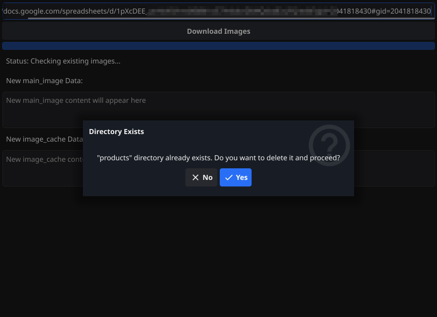
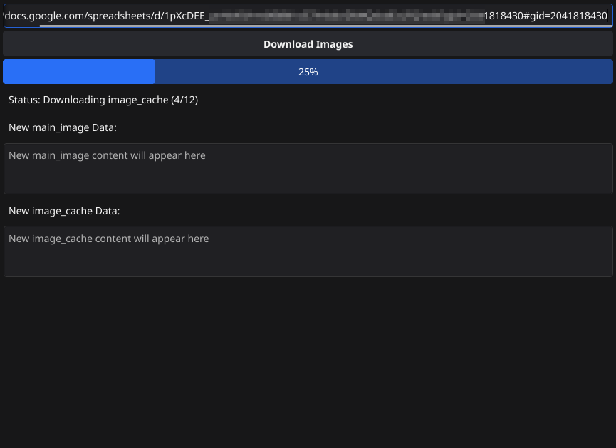

# OCImageDownloader

**OCImageDownloader** is a desktop GUI application built with Go and the [Fyne](https://fyne.io/) toolkit. It allows users to download images from URLs specified in a Google Spreadsheet, organizing them into a structured directory format. The application fetches image URLs from a CSV export of the spreadsheet, downloads them, and updates the spreadsheet with the local file paths.

## Features

- **User-Friendly Interface**: Simple and intuitive GUI to input Google Spreadsheet URLs and manage downloads.
- **Directory Management**: Automatically checks for existing directories and prompts users to delete them before proceeding.
- **Progress Tracking**: Real-time progress bar and status updates during the download process.
- **Resizable Text Areas**: Scrollable and resizable text areas to display new `main_image` and `image_cache` paths.
- **Browser-Like Downloads**: Mimics browser behavior by setting appropriate HTTP headers and handling cookies.

## Screenshots


*Starting of OCImageDownloader with existing image dir*


*Main interface of OCImageDownloader showing URL input, progress bar, and text areas.*

## Installation

### Prerequisites

- **Go**: Ensure you have Go installed. You can download it from [golang.org](https://golang.org/dl/).
- **Fyne Toolkit**: Install Fyne v2 by running:

  ```bash
  go get fyne.io/fyne/v2
  ```

### Clone the Repository

```bash
git clone https://github.com/vitovt/OCImageDownloader.git
cd OCImageDownloader
```

### Build the Application

```bash
go build -o OCImageDownloader main.go
```

### Run the Application

After building, run the application with:

```bash
./OCImageDownloader
```

On Windows, the executable will be `OCImageDownloader.exe`.

Alternatively, you can run it directly without building:

```bash
go run main.go
```

## Usage

1. **Enter Spreadsheet URL**:
   - Open the application and paste your Google Spreadsheet URL into the input field labeled "Enter Google Spreadsheet URL".

2. **Download Images**:
   - Click the "Download Images" button to start the download process.

3. **Handling Existing Directory**:
   - If a `products` directory already exists in the application's directory, a confirmation dialog will appear.
   - **Yes**: Deletes the existing `products` directory and proceeds with downloading.
   - **No**: Aborts the download operation.

4. **Monitor Progress**:
   - The progress bar and status label will update in real-time, indicating the current status of the download process.

5. **View New Data**:
   - After the download completes, the new `main_image` and `image_cache` data (file paths starting with `products/...`) will appear in the respective text areas.
   - These text areas are scrollable and resizable. You can select and copy the text to paste back into your spreadsheet.

## Example Workflow

### Spreadsheet Structure

| main_image                   | image_cache                                     | brand_seo_url | seo_url     |
|------------------------------|-------------------------------------------------|---------------|-------------|
| http://example.com/image1.jpg | http://example.com/image2.jpg\|http://example.com/image3.jpg | BrandA        | product-123 |

### After Processing

- **Images Saved**:
  - `products/BrandA/product-123_main_image_0.jpg`
  - `products/BrandA/product-123_image_cache_0_0.jpg`
  - `products/BrandA/product-123_image_cache_0_1.jpg`

- **New Data Displayed**:
  - **main_image Text Box**:
    ```
    products/BrandA/product-123_main_image_0.jpg
    ```
  - **image_cache Text Box**:
    ```
    products/BrandA/product-123_image_cache_0_0.jpg|products/BrandA/product-123_image_cache_0_1.jpg
    ```

### Updating Spreadsheet

1. **main_image**:
   - Copy the content from the `main_image` text box.
   - Paste it into the `main_image` column in your spreadsheet.

2. **image_cache**:
   - Similarly, copy the `image_cache` data.
   - Paste it into the `image_cache` column.

## Contributing

Contributions are welcome! Please follow these steps to contribute:

1. **Fork the Repository**:
   - Click the "Fork" button at the top-right corner of this page.

2. **Clone Your Fork**:
   ```bash
   git clone https://github.com/vitovt/OCImageDownloader.git
   cd OCImageDownloader
   ```

3. **Create a New Branch**:
   ```bash
   git checkout -b feature/YourFeatureName
   ```

4. **Make Your Changes**:
   - Implement your feature or fix.

5. **Commit Your Changes**:
   ```bash
   git commit -m "Add feature: YourFeatureName"
   ```

6. **Push to Your Fork**:
   ```bash
   git push origin feature/YourFeatureName
   ```

7. **Create a Pull Request**:
   - Navigate to the original repository and create a pull request from your fork.

## License

This project is licensed under the [MIT License](LICENSE).

## Acknowledgements

- Built with the [Fyne](https://fyne.io/) toolkit.
- Inspired by the need to automate image downloads from Google Spreadsheets.

## Contact

For any inquiries or support, don't hesitate to contact me.

